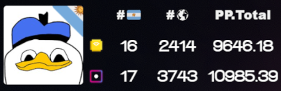
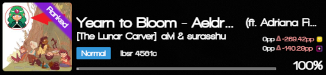
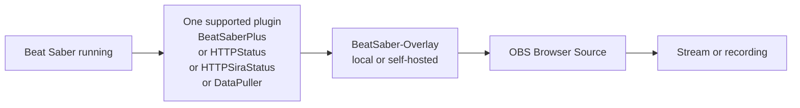

# BeatSaber-Overlay

BeatSaber-Overlay is a browser-based overlay for Beat Saber streams and recordings. It connects to data exposed by supported Beat Saber plugins and displays a customizable Player Card and Song Card that can be added to OBS as a Browser Source.

## What It Looks Like

### Player Card example



### Song Card example



## Maintainer Note

This repository is a maintained fork of the original project by [Hyldra Zolxy](https://github.com/HyldraZolxy), available here: [HyldraZolxy/BeatSaber-Overlay](https://github.com/HyldraZolxy/BeatSaber-Overlay).

The upstream repository was archived by its owner on **March 1, 2026** and is now read-only. The original hosted page is no longer a reliable way to use the overlay, so this fork exists to keep the project usable for local and self-hosted setups.

This fork is intended to preserve usability and share improvements with the community. Original authorship and project credit remain with Hyldra Zolxy.

## Project Status

- Upstream repository status: archived and read-only as of March 1, 2026
- This fork focus: keep the overlay usable locally and document a working setup
- Maintenance scope: practical fixes and quality-of-life improvements, without claiming ownership of the original project

## What This Fork Adds

- Docker support for a quick local/self-hosted setup
- Apache + PHP setup documentation for non-Docker environments
- BeatLeader support in the Player Card
- Improved Player Card PP/rank presentation
- TypeScript build configuration cleanup for easier local builds

## Runtime Requirements

- Beat Saber must be installed
- At least one supported plugin must be installed in your Beat Saber setup
- Some plugins may require their own dependencies or in-game configuration
- [BSManager](https://www.bsmanager.io/) is a good default way to install Beat Saber mods and their dependencies
- Beat Saber must be running for live overlay data to appear
- OBS or another browser-source-capable streaming app is needed to show the overlay on stream

## Recommended Beginner Path

If you just want the easiest working setup, use this combination:

- [Docker Desktop](https://www.docker.com/products/docker-desktop/)
- [Git](https://git-scm.com/downloads)
- Beat Saber installed on the same PC as OBS
- **BeatSaberPlus** installed with [BSManager](https://www.bsmanager.io/)

That is the most beginner-friendly path for this repository.

Typical flow:

1. Install Docker Desktop and Git.
2. Install **BeatSaberPlus** with **BSManager**.
3. Follow the Docker guide in [docs/docker.md](docs/docker.md).
4. Open the local setup page, copy the generated URL, and paste it into OBS as a Browser Source.

## How It Works

The overlay runs in a browser and is usually added to OBS or similar streaming software as a Browser Source.

It reads data from one of these supported Beat Saber plugins:

You only need **one** of the plugins below. They are alternative data sources for the overlay. For example, if you already use **BeatSaberPlus** and it is installed and enabled correctly, that alone is enough for the overlay to work.

- [BeatSaberPlus](https://github.com/hardcpp/BeatSaberPlus) - direct websocket integration
- [HTTPStatus](https://github.com/opl-/beatsaber-http-status/releases) - supported through the HTTP/Sira status integration path
- [HTTPSiraStatus](https://github.com/denpadokei/HttpSiraStatus/releases) - supported through the HTTP/Sira status integration path
- [DataPuller](https://github.com/kOFReadie/BSDataPuller/releases) - supported through map/live websocket endpoints

These are the specific plugin integrations currently implemented in this repository.

For most users, the simplest path is: install **BeatSaberPlus** with **BSManager**, make sure it is enabled, then configure this overlay for OBS.

## Basic Usage

Hosting the overlay locally and feeding it live data are two separate parts of the setup: the local server hosts the overlay page, and one supported Beat Saber plugin provides the live game data.



The overlay page can load without the game, but live stats only appear when Beat Saber and one supported plugin are active.

1. Install one supported Beat Saber plugin and any dependencies it requires.
2. Start Beat Saber so the plugin can expose live data.
3. Run this overlay locally with Docker or Apache + PHP.
4. Open the overlay in your browser and use the built-in setup UI to generate the final OBS URL. See the setup page URLs in the hosting section below.
5. Add that generated URL to an OBS **Browser Source**.

If you are using BeatSaberPlus, the common setup is to install it with BSManager and let BSManager handle the required dependencies for you.

Plugin installation example:

```text
Beat Saber\Plugins\BeatSaberPlus.dll
```

Setup UI flow:

1. Open the overlay page in your browser.
2. Click the settings button to open the setup panel.
3. Enter your ScoreSaber profile URL or player ID if you want the **Player Card** to show your player profile, rank, and PP.
4. Adjust the available card settings such as skin, position, and scale.
5. Copy the generated URL and paste it into OBS as a Browser Source.

Setup UI reference:


OBS notes:

- The easiest beginner setup is: Beat Saber, BeatSaberPlus, the overlay, and OBS all running on the same PC.
- In that case, open the local setup page, keep the default connection settings unless you know you need something different, and copy the generated URL into OBS.
- If the overlay opens in OBS but shows no live stats, the most common causes are: Beat Saber is not running yet, the plugin is not enabled, or the game and the overlay are not pointing to the same PC.
- A quick success check is to open the setup page in your browser first: once Beat Saber is running with the plugin enabled, the live song/game section should start updating there before you even paste the URL into OBS.
- Width and height depend on your scene layout, but the source should behave like a normal browser overlay once the URL is correct.

## Hosting Options

Choose one local hosting method:

### Recommended: Docker

For most users, Docker is the easiest way to get a working local instance.

The Docker guide includes the exact copy/paste commands and explains how to open a command-line window before running them.

See [docs/docker.md](docs/docker.md) for the full setup.

Docker setup page:

- [http://localhost:8080/index.html](http://localhost:8080/index.html)

### Alternative: Apache + PHP

If you prefer running it with a local web server instead of Docker, use the Apache + PHP setup guide:

That guide also includes the exact commands to copy/paste and explains the local Apache/PHP requirements first.

[docs/php.md](docs/php.md)

Apache + PHP setup page:

- [http://localhost/BeatSaber-Overlay/index.html](http://localhost/BeatSaber-Overlay/index.html)

For manual URL details, see [`js/parameters.ts`](js/parameters.ts).

## Original Project Credits

This project was originally created by [Hyldra Zolxy](https://github.com/HyldraZolxy). This fork only maintains and extends the project so it remains usable for others.

Existing credits from the original project:

- Thanks to `@hardcpp` for the cache system
- Thanks to `@reselim` for permission to use the Reselim overlay skin style

## Notes for Users

- If the overlay page loads but shows no live data, first check that Beat Saber is running and that one supported plugin is installed and enabled. If you want a concrete reference case, start with BeatSaberPlus.
- If you play and stream from the same PC, the default setup values usually work without extra changes.
- If Beat Saber runs on another PC, open the setup UI and change the connection target to that machine instead of leaving the local default.
- If your selected plugin has its own dependencies or in-game module settings, verify those before troubleshooting the local server setup.
- If you only need a reliable local setup, prefer the Docker path first.

## Contact and Upstream

- Original upstream repository: [HyldraZolxy/BeatSaber-Overlay](https://github.com/HyldraZolxy/BeatSaber-Overlay)
- This repository should be understood as a maintained fork, not a rebranded replacement
