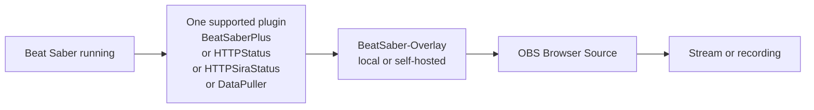

# BeatSaber-Overlay

BeatSaber-Overlay is a browser-based overlay for Beat Saber streams and recordings. It connects to data exposed by supported Beat Saber plugins and displays a customizable Player Card and Song Card that can be added to OBS as a Browser Source.

This repository is a maintained fork of the original [BeatSaber-Overlay](https://github.com/HyldraZolxy/BeatSaber-Overlay) project by [Hyldra Zolxy](https://github.com/HyldraZolxy). See [Fork and Upstream](#fork-and-upstream) for details.

## What This Fork Adds

- Simple PHP built-in server setup for local use (no Apache, no Docker required)
- BeatLeader support in the Player Card
- Improved Player Card PP/rank presentation
- Song Card SS/BL stars and PP row layout improvements
- Player nickname display in the Player Card and Song Card
- TypeScript build configuration cleanup for easier local builds

## What It Looks Like

### Player Card example


### Song Card example


## Simplest Case Scenario

The most straightforward setup is: Beat Saber, BeatSaberPlus, this overlay, and OBS all running on the same PC.

Before starting, install [PHP 8+](https://www.php.net/downloads.php), [Node.js 18+](https://nodejs.org/), [Git](https://git-scm.com/downloads), Beat Saber, and [BSManager](https://www.bsmanager.io/) with **BeatSaberPlus**.

Open PowerShell, Windows Terminal, or Command Prompt in the folder where you want to download the project, then run:

```powershell
git clone https://github.com/XelNagah/BeatSaber-Overlay.git
cd BeatSaber-Overlay
npm install
npm run build
php -S 127.0.0.1:8080 -t .
```

Leave that command-line window open, then open:

- [http://127.0.0.1:8080/index.html](http://127.0.0.1:8080/index.html)

For more detailed step-by-step instructions and troubleshooting, see [docs/php.md](docs/php.md).

## Add It to OBS

1. Start Beat Saber with **BeatSaberPlus** enabled.
2. Open the setup page: [http://127.0.0.1:8080/index.html](http://127.0.0.1:8080/index.html).
3. Enter your ScoreSaber profile URL or player ID if you want the **Player Card** to show your profile and rank.
4. Adjust the card settings you want.
5. Copy the generated overlay URL.
6. In OBS, add a new **Browser Source** and paste the generated URL.
7. Resize and position it like any other browser-based overlay.

The overlay page can open even if Beat Saber is closed, but live song/game data only appears when Beat Saber is running and one supported plugin is active.

## Hosting Options

Choose one local hosting method:

### Recommended: PHP built-in server

For most users, the PHP built-in server is the recommended way to get a working local instance.

See [docs/php.md](docs/php.md) for the full setup.

PHP setup page:

- [http://127.0.0.1:8080/index.html](http://127.0.0.1:8080/index.html)

### Alternative: Docker

Use Docker if you prefer running the overlay in a container.

See [docs/docker.md](docs/docker.md) for the full setup.

Docker setup page:

- [http://localhost:8080/index.html](http://localhost:8080/index.html)

### Advanced: Apache + PHP

Use Apache only if you already have a local Apache/PHP environment and prefer that setup.

See [docs/apache.md](docs/apache.md) for the full setup.

Apache + PHP setup page:

- [http://localhost/BeatSaber-Overlay/index.html](http://localhost/BeatSaber-Overlay/index.html)

For manual URL details, see [`js/parameters.ts`](js/parameters.ts).

## Troubleshooting

**The page opens, but no live data appears**

- Make sure Beat Saber is running.
- Make sure one supported plugin is installed and enabled.
- For the simplest reference setup, start with BeatSaberPlus on the same PC as OBS.

**The Player Card is empty**

- Open the setup page and enter your ScoreSaber profile URL or player ID.

**The page is blank or JavaScript does not load**

- Run `npm run build`.
- Confirm that the generated `.js` files exist in `js/`.

**Beat Saber runs on another PC**

- Open the setup page and change the connection target to the PC running Beat Saber instead of leaving the local default.
- Make sure that PC allows the required local network traffic.

**PHP proxy returns HTTP 500 or player data does not load**

- Make sure `allow_url_fopen = On` in PHP.
- Make sure PHP can reach external HTTPS APIs.
- Optional quick check: [http://127.0.0.1:8080/php/scoreSaberProxy.php?playerId=76561198023909381](http://127.0.0.1:8080/php/scoreSaberProxy.php?playerId=76561198023909381)

## How It Works

Hosting the overlay locally and feeding it live data are two separate parts of the setup: the local server hosts the overlay page, and one supported Beat Saber plugin provides the live game data.



You only need **one** of the plugins below. They are alternative data sources for the overlay.

- [BeatSaberPlus](https://github.com/hardcpp/BeatSaberPlus) - direct websocket integration
- [HTTPStatus](https://github.com/opl-/beatsaber-http-status/releases) - supported through the HTTP/Sira status integration path
- [HTTPSiraStatus](https://github.com/denpadokei/HttpSiraStatus/releases) - supported through the HTTP/Sira status integration path
- [DataPuller](https://github.com/kOFReadie/BSDataPuller/releases) - supported through map/live websocket endpoints

For most users, the simplest plugin path is to install **BeatSaberPlus** with **BSManager** and let BSManager handle the required dependencies.

## Fork and Upstream

This repository is a maintained fork of the original project by [Hyldra Zolxy](https://github.com/HyldraZolxy), available here: [HyldraZolxy/BeatSaber-Overlay](https://github.com/HyldraZolxy/BeatSaber-Overlay).

The upstream repository was archived by its owner on **March 1, 2026** and is now read-only. The original hosted page is no longer a reliable way to use the overlay, so this fork exists to keep the project usable for local and self-hosted setups.

This fork is intended to preserve usability and share improvements with the community. Original authorship and project credit remain with Hyldra Zolxy.

Current maintenance focus: practical fixes, local setup documentation, and quality-of-life improvements without claiming ownership of the original project.

## Original Project Credits

This project was originally created by [Hyldra Zolxy](https://github.com/HyldraZolxy). This fork only maintains and extends the project so it remains usable for others.

Existing credits from the original project:

- Thanks to `@hardcpp` for the cache system
- Thanks to `@reselim` for permission to use the Reselim overlay skin style
